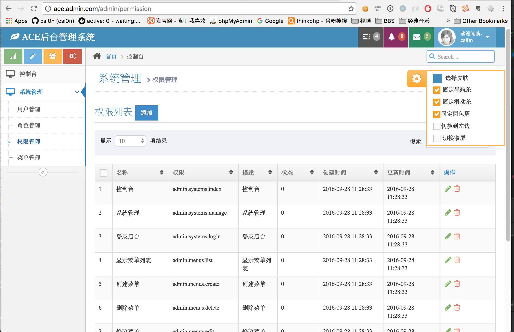

# Ace-Admin后台管理

基于`Laravel5.2`的后台管理，实现最基本的后台框架：权限、角色、菜单、用户，后台主题是用的[ace主题](https://wrapbootstrap.com/theme/ace-responsive-admin-template-WB0B30DGR)，本人代码完全开源，至于主题只供学习交流。如需商业应用请自行购买授权！
代码参考了[lanceWan](https://github.com/lanceWan/IAdmin)
(非常感谢lanceWan的项目),当然,加入了一点自己的内容。


## 安装

安装本项目跟普通安装一样

1. 下载本项目,然后在项目根目录执行 `composer install`
2. 包安装完成后,复制.env.example 文件为.env
3. 执行 `php artisan key:generate`
4. 迁移数据: `php artisan migrate --seed`  

OK,项目已经配置完成，后台地址：example.com/admin，不清楚的可以直接去看 `routes.php` 文件。默认管理员账号：`admin@admin.com` , 密码：`123456` 

## 验证码一直错误问题

如果你的验证码包(mews/captcha)版本是`2.12`,但是登录后台的时候一直出现验证码错误，请在 `vendor\mews\captcha\src\CaptchaServiceProvider.php` 中添加一下代码：

```php
// HTTP routing
if (strpos($this->app->version(), 'Lumen') !== false) {
    //Laravel Lumen
    $this->app->get('captcha[/{config}]', 'Mews\Captcha\LumenCaptchaController@getCaptcha');
} else if (starts_with($this->app->version(), '5.2.') !== false) {
    //Laravel 5.2.x
    $this->app['router']->get('captcha/{config?}', '\Mews\Captcha\CaptchaController@getCaptcha')->middleware('web');
} else {
    //Laravel 5.0.x ~ 5.1.x
    $this->app['router']->get('captcha/{config?}', '\Mews\Captcha\CaptchaController@getCaptcha');
}
```

将文件中对应的代码替换掉就可以正常登录了，github上的代码已经是修复了这个Laravel5.2的bug，但是用composer下载的时候代码却没有更新，所以只好现在手动加上去了，等作者更新一个版本后估计就没有这个问题了。